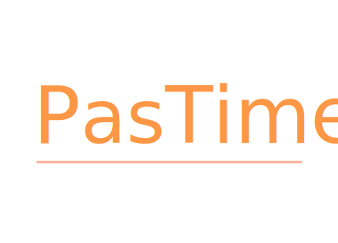

# PasTime  😎
pastime 프로젝트

다양한 지역과 관심사가 모여있는 **모임 웹사이트**

## 프로젝트 소개  😃
위치기반으로 다양한 취미를 가진 사람들 간의 **모임을 관리해주고 소통 공간을 제공**해주는 웹사이트

pastime = 취미 , 사람들을 그룹으로 연결 해서 같이 취미활동을 할 수 있도록 하는 service 개발!
### 프로젝트 목적 🧐

새로운 취미를 찾아 자신의 주변 사람들과 모임을 만들고 싶다는 니즈를 반영하여 
모임을 **개설하고 관리**해주는 웹사이트를 개발.

### 주요기능 👊
* 모임 개설 (Google Map 적용)
* 모임 결제 (구현)
* 회원과 모임관리가 가능한 어드민 페이지 (구현 중)
* oAuth 2.0 로그인, 회원가입 구현 (미 구현)
* 모임별 채팅기능 (미 구현) , 모임 개설시 google map api 적용 (구현)

### 개발환경 🌎 
* Spring Tool Suite 3
* Visual Studio Code
* Apache Tomcat 8.5
* Mysql 8.5 

## 프로젝트 참여팀원 💪 
조용원 
이용혁
최재형

